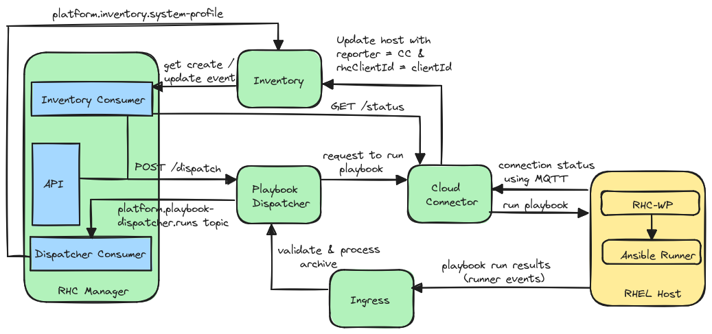

# Config Manager

Config Manager is a backend service used by the Service Enablement dashboard to enable or disable various Red Hat services on hosts connected through RHC.

Config Manager handles the following actions:

- Receives the new configuration (enabled/disabled) of various services supported by Service Enablement 
- Retrieves the current configuration of the services from the profile table for given org ID.
- Updates the current configuration of services based on the new configuration.
- Maintains a history of configuration changes
- Ensures that newly connected hosts are kept up to date with the latest configuration
- Updates the host's system profile in Inventory with the latest "rhc_config_state" ID

Config Manager has two mechanisms to update a host:

- Via a change in the Service Enablement dashboard - updates all the hosts belonging to a given org ID.
- Via a new rhc connection event from Inventory - updates a single host.

Updating a host (all hosts) via the Inventory events or API:

## REST interface

The REST interface can be used to view and update the current configuration for all hosts connected through RHC. It can also be used to view a history of previous configuration changes, and obtain logs related to those changes. 

See the [OpenAPI Schema](./internal/http/v2/openapi.json) for details on interacting with the REST interface.

- GET /profiles       - get a list of all historical profiles of an org ID
- GET /profiles/{id} - get a single profile by `id` param where "{id}" is either a specific “profile_id” or the special string "current", in which case the most recent profile is retrieved.
- POST /profiles     - creates a profile
- GET /playbooks   - constructs and returns a playbook suitable for configuring a host to the state of the given profile using `profile_id` param

## Event interface

Config-manager consumes and produces kafka messages based on various events.

In topics:
- platform.inventory.events - receives data from Inventory.
- platform.playbook-dispatcher.runs -  receives data from Playbook Dispatcher.

Out topics:
- platform.inventory.system-profile - sends data to Inventory.

Event based workflow:
1. Consume new connection event from inventory
2. If connection is reported via cloud-connector check rhc_config_state in host's system profile
3. If rhc_config_state is out of date apply current state to host
4. Consume run events from playbook-dispatcher
5. If run event is successful write new rhc_config_state to host via the system-profile kafka topic.

## Development

See the
[DEV-SETUP](./docs/dev-setup.md)
guide for details on getting started contributing to config-manager.
