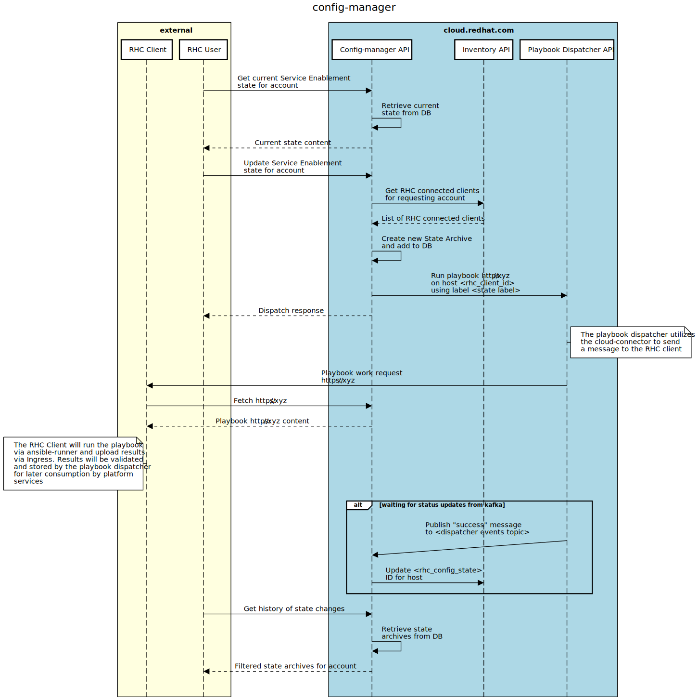

# Config Manager

Config Manager is a backend service used by the Service Enablement dashboard to enable or disable various Red Hat services on hosts connected through RHC.

Config Manager handles the following actions:

- Retrieves the current configuration (enabled/disabled) of various services supported by Service Enablement 
- Updates the current configuration of services
- Maintains a history of configuration changes
- Ensures that newly connected hosts are kept up to date with the latest configuration
- Updates the host's system profile in Inventory with the latest "rhc_config_state" ID

Config Manager has two mechanisms to update a host:

- Via a change in the Service Enablement dashboard
- Via a new rhc connection event from Inventory

Updating a host (all hosts) via the API:



## REST interface

The REST interface can be used to view and update the current configuration for all hosts connected through RHC. It can also be used to view a history of previous configuration changes, and obtain logs related to those changes. 

See the [OpenAPI Schema](./schema/api.spec.yaml) for details on interacting with the REST interface.

## Event interface

Config-manager consumes and produces kafka messages based on various events.

In topics:
- platform.inventory.events
- platform.playbook-dispatcher.runs

Out topics:
- platform.inventory.system-profile

Event based workflow:
1. Consume new connection event from inventory
2. If connection is reported via cloud-connector check rhc_state_id in host's system profile
3. If rhc_state_id is out of date apply current state to host
4. Consume run events from playbook-dispatcher
5. If run event is successful write new rhc_state_id to host via the system-profile kafka topic.

## Development

### Dependencies

- Golang >= 1.13
- Minikube (see [here](https://consoledot.pages.redhat.com/docs/dev/getting-started/local/environment.html#_install_minikube))
- oc cli (see [here](https://docs.openshift.com/container-platform/4.2/cli_reference/openshift_cli/getting-started-cli.html#cli-installing-cli_cli-developer-commands))
- Bonfire (see [here](https://github.com/RedHatInsights/bonfire#installation))
- Quay Pull Secret (see [here](https://consoledot.pages.redhat.com/docs/dev/getting-started/local/environment.html#_get_your_quay_pull_secret))

### Deploying locally

Config-manager is managed by [Clowder](https://github.com/RedHatInsights/clowder) and can be deployed locally onto a [Minikube](https://minikube.sigs.k8s.io/docs/start/) instance using [Bonfire](https://github.com/RedHatInsights/bonfire).

The following steps (detailed [here](https://consoledot.pages.redhat.com/docs/dev/getting-started/local/environment.html)) should be performed before attempting to build and deploy a new instance of config-manager:

1. Start minikube (check [here](https://github.com/RedHatInsights/clowder/blob/master/docs/macos.md) for MacOS instructions)
```sh
minikube start --cpus 4 --disk-size 36GB --memory 8000MB --addons=registry --driver=kvm2
```

2. Install Clowder CRDs
```sh
curl https://raw.githubusercontent.com/RedHatInsights/clowder/master/build/kube_setup.sh -o kube_setup.sh && chmod +x kube_setup.sh
./kube_setup.sh
```

3. Install Clowder (replace version with [latest](https://github.com/RedHatInsights/clowder/releases/latest))
```sh
minikube kubectl -- apply -f https://github.com/RedHatInsights/clowder/releases/download/0.15.0/clowder-manifest-0.15.0.yaml --validate=false
```

4. Create a namespace for config-manager
```sh
minikube kubectl -- create ns config-manager
```

5. Download your quay secret if you haven't already, and add it to the
   config-manager namespace
```sh
minikube kubectl -- create $USER-secret.yml --namespace config-manager
```

6. Deploy ClowdEnvironment
```sh
bonfire deploy-env -n config-manager -u $USER
```

7. Deploy config-manager
```sh
./bonfire_deploy.sh
```

8. Access config-manager
```sh
oc port-forward svc/config-manager-service -n config-manager 8000 &
curl -v -H "x-rh-identity:eyJpZGVudGl0eSI6IHsiYWNjb3VudF9udW1iZXIiOiAiMDAwMDAwMSIsICJpbnRlcm5hbCI6IHsib3JnX2lkIjogIjAwMDAwMSJ9fX0=" http://localhost:8000/api/config-manager/v1/states/current
```

Once prerequisite steps 1-6 have been completed steps 7-8 can be repeated as needed to deploy new changes to the local environment. 
